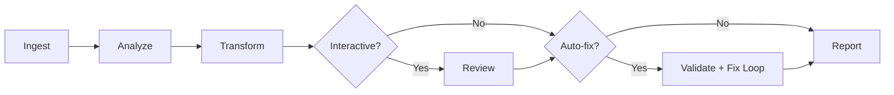

# ROSForge

**AI-driven ROS1 to ROS2 migration CLI tool.**

[](https://github.com/Rlin1027/ROSForge/actions) [](https://pypi.org/project/rosforge/) [](https://pypi.org/project/rosforge/) [](LICENSE)

## Why ROSForge?

ROS1 reached end-of-life in May 2025. Migrating a production codebase to ROS2 by hand is tedious and error-prone: API namespaces changed, CMakeLists.txt rules are different, launch files moved from XML to Python, and hundreds of `ros::` calls need one-by-one replacement.

ROSForge automates this work by combining a **static knowledge base** of known API mappings with an **AI backend** that handles the cases rules alone cannot cover. The result is a complete, confidence-scored migration in minutes rather than days.

## Features

- **Full pipeline** — analyze, transform, validate, and report in a single command
- **BYOM (Bring Your Own Model)** — Claude, Gemini, and OpenAI backends; CLI or API mode
- **Auto-fix loop** — runs `colcon build`, feeds errors back to the AI, retries up to N times
- **Interactive mode** — per-file diff review; accept or skip each transformed file
- **Batch workspace migration** — migrate an entire catkin workspace in one pass
- **Custom transformation rules** — override or extend mappings with a YAML file
- **Static knowledge base** — built-in C++/Python API mappings, CMake rules, and launch conversion patterns
- **Cost estimation** — token and USD estimates shown before any API calls are made
- **Confidence scoring** — every output file is rated HIGH / MEDIUM / LOW; low-confidence files are flagged for manual review
- **CI/CD templates** — ready-made GitHub Actions and GitLab CI integration

## Requirements

- **Python 3.10+**
- **pip** (or [uv](https://docs.astral.sh/uv/))
- One of the following AI backends:
  - [Claude CLI](https://docs.anthropic.com/en/docs/claude-code) or an Anthropic API key
  - [Gemini CLI](https://github.com/google-gemini/gemini-cli) or a Google API key
  - An OpenAI API key
- (Optional) `colcon` — required only if you use the auto-fix loop (`--max-fix-attempts`)

## Quick Start

```bash
# 1. Install
pip install rosforge

# 2. Configure your AI backend
rosforge config set engine.name claude
rosforge config set engine.mode cli

# 3. Analyze a package first (no code changes, no AI calls)
rosforge analyze ./my_ros1_package

# 4. Run the migration
rosforge migrate ./my_ros1_package -o ./my_ros1_package_ros2
```

**Expected output:**

```
  ╭─ ROSForge ─────────────────────────────────────╮
  │  AI-driven ROS1 → ROS2 Migration               │
  ╰─────────────────────────────────────────────────╯
  Engine: claude-cli
  Source: /home/user/catkin_ws/src/my_ros1_package
  Output: /home/user/catkin_ws/src/my_ros1_package_ros2
  Target distro: humble

  [1/6] Ingest .............. done
  [2/6] Analyze ............. done
  [3/6] Transform ........... done
  [4/6] Report .............. done

  Migration complete. Report: /home/user/.../migration_report.md
    Files transformed: 12 (8 rule-based, 4 AI-driven)
    Average confidence: 87%
    Confidence breakdown: 9 HIGH, 2 MEDIUM, 1 LOW

  Low-confidence files (manual review recommended):
    • src/legacy_driver.cpp
```

The migrated package and a `migration_report.md` are written to the output directory.

## How It Works

ROSForge runs a multi-stage pipeline on your ROS1 package:



1. **Ingest** — parses `package.xml`, `CMakeLists.txt`, C++/Python sources, launch files, and msg/srv/action definitions
2. **Analyze** — resolves dependencies, scores risk, estimates cost, and decides per-file strategy (rule-based vs. AI-driven)
3. **Transform** — applies static knowledge base mappings first, then sends remaining files to the AI engine
4. **Review** *(optional, `--interactive`)* — shows a diff for each file; press `a` to accept, `s` to skip, `q` to quit
5. **Validate** *(optional, `--max-fix-attempts N`)* — runs `colcon build`; if it fails, feeds errors to the AI for auto-fix, up to N retries
6. **Report** — generates `migration_report.md` with a full changelog, warnings, and manual intervention suggestions

## Commands

| Command | Description |
|---|---|
| `rosforge migrate <path>` | Migrate a single ROS1 package to ROS2 |
| `rosforge migrate-workspace <path>` | Migrate all packages in a catkin workspace |
| `rosforge analyze <path>` | Analyze and report migration complexity (no code changes) |
| `rosforge config set <key> <value>` | Set a configuration value |
| `rosforge config get <key>` | Get a single configuration value |
| `rosforge config list` | Print all current settings as JSON |
| `rosforge config reset` | Reset configuration to defaults |
| `rosforge config path` | Show the config file path |
| `rosforge status` | Show the status of a completed migration |

Configuration is stored at `~/.rosforge/config.toml`.

## AI Engine Configuration

ROSForge supports three AI backends. Each can run in **CLI mode** (calls a locally installed CLI tool, no API key required) or **API mode** (calls the provider's REST API, requires an API key).

### Claude (Anthropic)

```bash
# CLI mode — requires Claude CLI installed and authenticated
rosforge config set engine.name claude
rosforge config set engine.mode cli

# API mode — requires ANTHROPIC_API_KEY
pip install "rosforge[claude]"
rosforge config set engine.name claude
rosforge config set engine.mode api
export ANTHROPIC_API_KEY=sk-ant-...
```

### Gemini (Google)

```bash
# CLI mode — requires Gemini CLI installed and authenticated
rosforge config set engine.name gemini
rosforge config set engine.mode cli

# API mode — requires GOOGLE_API_KEY
pip install "rosforge[gemini]"
rosforge config set engine.name gemini
rosforge config set engine.mode api
export GOOGLE_API_KEY=AIza...
```

### OpenAI

```bash
# API mode — requires OPENAI_API_KEY
pip install "rosforge[openai]"
rosforge config set engine.name openai
rosforge config set engine.mode api
export OPENAI_API_KEY=sk-...
```

Install all backends at once:

```bash
pip install "rosforge[all]"
```

## Advanced Usage

### Interactive review

Review each transformed file before it is written:

```bash
rosforge migrate ./my_package --interactive
```

Press `a` to accept, `s` to skip, `q` to quit and accept all remaining files.

### Auto-fix loop

Build the output with `colcon build` after migration, feed any errors back to the AI, and retry:

```bash
rosforge migrate ./my_package --max-fix-attempts 3
```

### Custom transformation rules

Supply additional or overriding transformation mappings via a YAML file:

```bash
rosforge migrate ./my_package --rules custom_rules.yaml
```

<details>
<summary><strong>Example custom_rules.yaml</strong></summary>

```yaml
# custom_rules.yaml
version: 1

api_mappings:
  cpp:
    "ros::NodeHandle": "rclcpp::Node"
    "ros::Publisher": "rclcpp::Publisher"
  python:
    "rospy.init_node": "rclpy.init"
    "rospy.Publisher": "rclpy.create_publisher"

package_mappings:
  "roscpp": "rclcpp"
  "rospy": "rclpy"

cmake_mappings:
  "find_package(catkin REQUIRED": "find_package(ament_cmake REQUIRED"
```

</details>

Custom mappings take precedence over the built-in knowledge base. See the `version: 1` schema for supported keys: `api_mappings.cpp`, `api_mappings.python`, `package_mappings`, `cmake_mappings`.

### Skip confirmation

Skip the cost-estimate confirmation prompt (useful in CI or scripted runs):

```bash
rosforge migrate ./my_package --yes
```

### Target ROS2 distribution

The default target is `humble`. To target a different distribution:

```bash
rosforge migrate ./my_package --distro jazzy
```

### Workspace migration

Migrate all packages in a catkin workspace at once:

```bash
rosforge migrate-workspace ./catkin_ws -o ./ros2_ws --engine gemini --yes
```

### Analyze without migrating

```bash
# Rich table output in the terminal
rosforge analyze ./my_package

# Machine-readable JSON (ideal for CI)
rosforge analyze ./my_package --json

# Save JSON report to file
rosforge analyze ./my_package -o analysis.json
```

## CI/CD Integration

ROSForge provides ready-made templates for GitHub Actions and GitLab CI so you can automatically verify ROS1→ROS2 migration in your pipeline.

### GitHub Actions

Use the reusable composite action:

```yaml
# .github/workflows/rosforge.yml
name: ROSForge Migration Check
on: [push, pull_request]

jobs:
  analyze:
    runs-on: ubuntu-latest
    steps:
      - uses: actions/checkout@v4
      - uses: Rlin1027/ROSForge/ci-templates/github@main
        with:
          source: ./src/my_ros1_package
          mode: analyze            # "analyze" or "migrate"
```

For a full migration dry-run with auto-fix:

```yaml
      - uses: Rlin1027/ROSForge/ci-templates/github@main
        with:
          source: ./src/my_ros1_package
          mode: migrate
          engine: claude
          engine-mode: api
          max-fix-attempts: "2"
          fail-on-warnings: "true"
        env:
          ANTHROPIC_API_KEY: ${{ secrets.ANTHROPIC_API_KEY }}
```

See [`ci-templates/github/example-workflow.yml`](ci-templates/github/example-workflow.yml) for a complete example.

### GitLab CI

Include the remote template and extend the hidden jobs:

```yaml
# .gitlab-ci.yml
include:
  - remote: "https://raw.githubusercontent.com/Rlin1027/ROSForge/main/ci-templates/gitlab/.gitlab-ci-rosforge.yml"

variables:
  ROSFORGE_SOURCE: ./src/my_ros1_package
  ROSFORGE_ENGINE: claude
  ROSFORGE_TARGET_DISTRO: humble

rosforge-analyze:
  extends: .rosforge-analyze

rosforge-migrate:
  extends: .rosforge-migrate
  variables:
    ROSFORGE_ENGINE_MODE: api
    ROSFORGE_MAX_FIX_ATTEMPTS: "2"
```

### Exit Codes

| Code | Meaning |
|------|---------|
| 0 | Success |
| 1 | Failure |
| 2 | Completed with warnings (set `fail-on-warnings` to treat as failure) |

## Troubleshooting

### "Engine not available" error

Make sure the engine CLI is installed and on your `PATH`:

```bash
# For Claude
claude --version

# For Gemini
gemini --version
```

If using API mode, verify the API key is set:

```bash
echo $ANTHROPIC_API_KEY   # Should not be empty
```

### "Command timed out" during migration

Large packages may exceed the default 300-second timeout. Set a longer timeout in the config:

```bash
rosforge config set engine.timeout_seconds 600
```

### Auto-fix loop fails immediately

The auto-fix loop requires `colcon` to be installed and on your `PATH`. On Ubuntu:

```bash
sudo apt install python3-colcon-common-extensions
```

### "Could not parse JSON from stdout"

This usually means the AI engine returned unexpected output. Try:

1. Run with `--verbose` to see the raw AI response
2. Switch to a different engine (some models are more reliable for structured output)
3. Retry — AI responses can vary between runs

### Config file location

ROSForge stores its configuration at `~/.rosforge/config.toml`. To find or reset it:

```bash
rosforge config path    # Show the file path
rosforge config reset   # Reset to defaults
```

## Development

```bash
# Clone and install in development mode
git clone https://github.com/Rlin1027/ROSForge.git
cd ROSForge
pip install -e ".[dev,all]"

# Run the test suite (700+ tests)
pytest tests/

# Lint and type-check
ruff check src/
ruff format --check src/
mypy src/
```

### Project structure

```
src/rosforge/
  cli/          # Typer CLI commands (migrate, analyze, config, status)
  config/       # ConfigManager — loads/saves ~/.rosforge/config.toml
  engine/       # BYOM engine backends (claude, gemini, openai × cli, api)
  knowledge/    # Static API mapping tables + custom rules loader
  models/       # Pydantic data models (config, result, report, source)
  parsers/      # File parsers (Python, C++, CMake, launch XML, msg/srv)
  pipeline/     # Pipeline stages (ingest, analyze, transform, review, validate, fix, report)
  templates/    # Jinja2 report templates
  utils/        # Subprocess helpers, JSON extraction
tests/
  unit/         # Unit tests for individual modules
  integration/  # Integration tests for cross-module workflows
  e2e/          # End-to-end CLI tests
  fixtures/     # Sample ROS1 packages for testing
```

## Roadmap

- [x] R-01~R-05: Core migration pipeline (v0.1.0)
- [x] R-06: Auto build verification & fix loop (v0.2.0)
- [x] R-07: Interactive migration mode (v0.2.0)
- [x] R-08: Batch workspace migration (v0.2.0)
- [x] R-09: Custom transformation rules (v0.2.0)
- [x] R-12: CI/CD integration templates (v0.2.0)
- [ ] R-10: Plugin API — community-contributed domain-specific strategies
- [ ] R-11: Web Dashboard — visual migration progress and diff viewer

## Contributing

Contributions are welcome! Please open an issue before submitting a pull request for significant changes. See [CONTRIBUTING.md](CONTRIBUTING.md) for guidelines.

## License

Apache 2.0 — see [LICENSE](LICENSE) for details.
